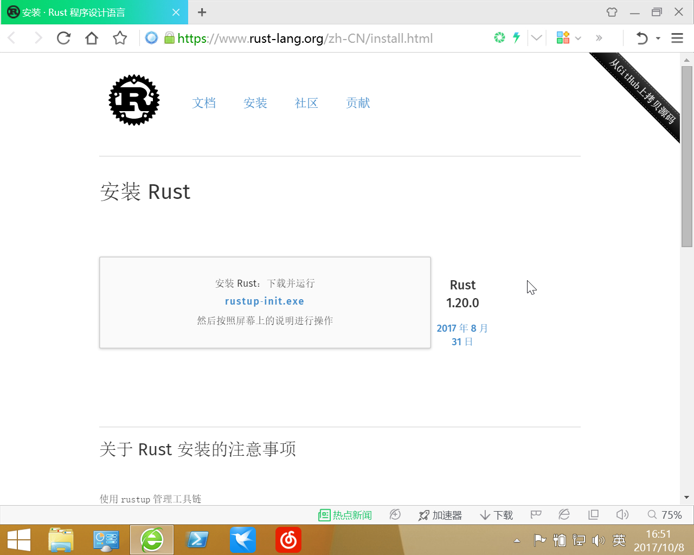
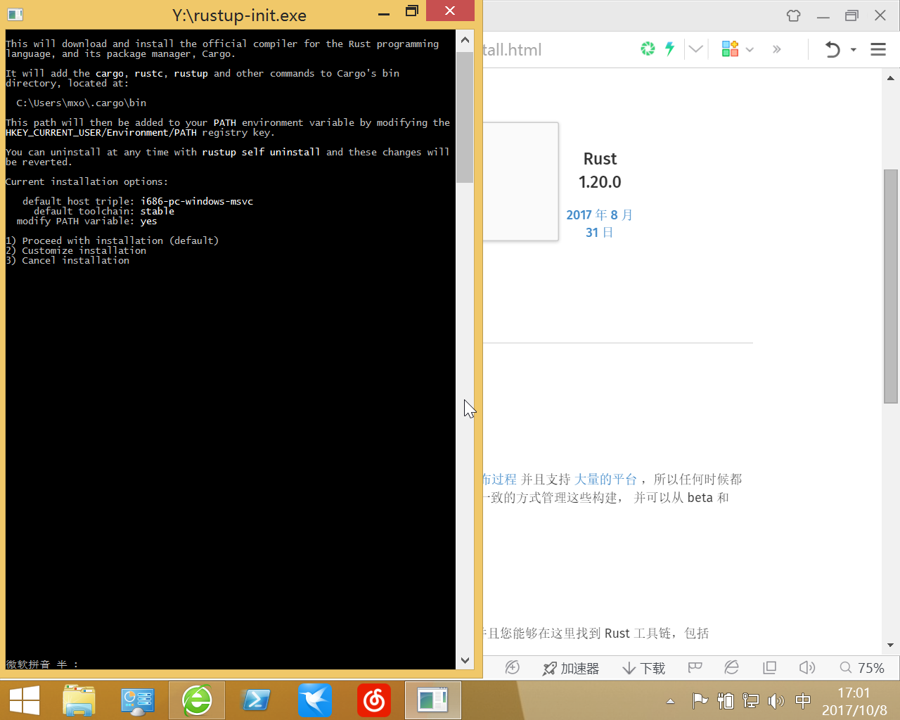
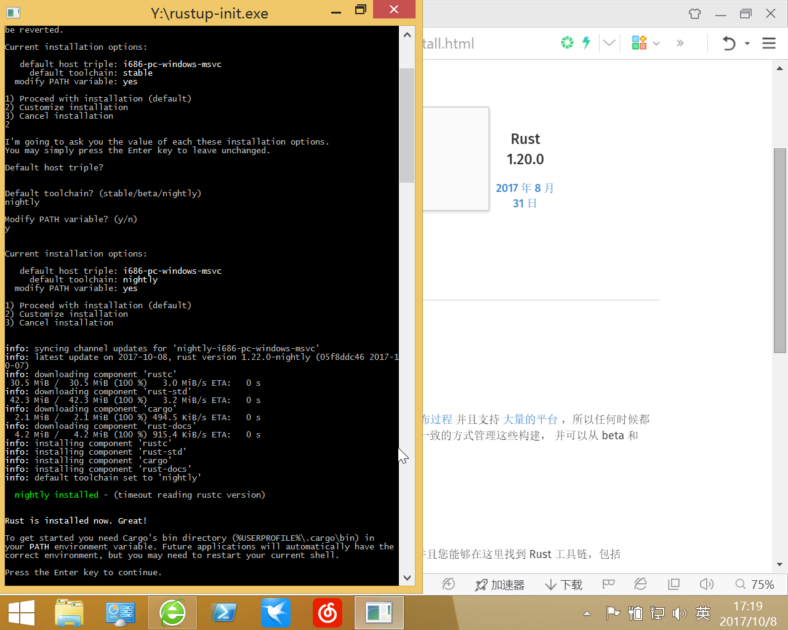
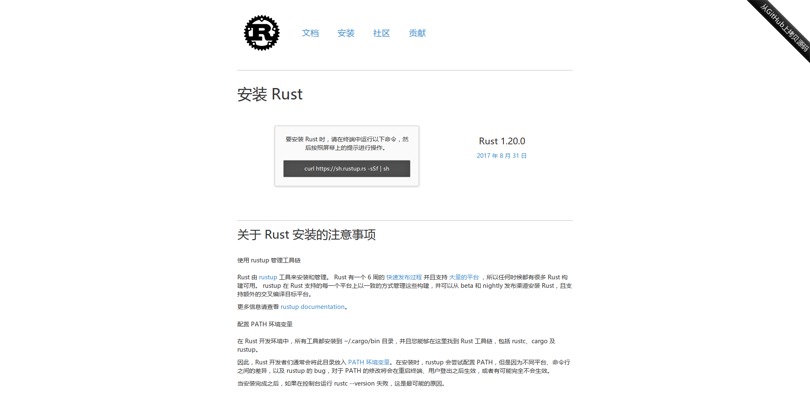

+++
title = 'Rust的安装与配置'
date = '2017-10-08 18:27:07'
slug = 'rustde-an-zhuang-yu-pei-zhi'
aliases = [ "articles/rustde-an-zhuang-yu-pei-zhi.html" ]

[taxonomies]
categories = ["articles"]
tags = [ "Rust", "cargo", "rustup" ]
+++

title: 
date: 
tags: Rust, cargo, rustup
Category: articles

Rust 是一种系统编程语言。 它有着惊人的运行速度，能够防止段错误，并保证线程安全。 

首先访问[Rust官网](https://www.rust-lang.org/zh-CN/install.html)的install页面, 它会根据你的UA显示不同的内容.

## Windows平台
我这里是32位的虚拟机,由于学校教务处只兼容360, 故虚拟机里只装了360浏览器, 我的主力是Firefox.  



Windows下载rustup‑init.exe点击运行如图:




它询问你安装配置, 你可以一路回车,它会使用默认的配置给你安装好稳定(stable)版
但我的建议是安装nightly工具链, 上面你输入`2`回车,   
接下来它问你第一个`Default host triple?`, 这是些平台信息, 不用管它, 回车即可,  
第二个是`Default toolchain?(stable,beta,nightly)`, 即安装的工具链版本, 这里你输入nightly回车即可,  
第三个是`Modify PATH variable? (y/n)`, 即修改环境变量, 输入`y`表示同意回车即可,  
然后它弹出一个安装清单`current installation options`, 就是上面那三个选项的内容(注意, 由于我这是32位虚拟机, 所以架构是i386, 大多数应该是x86-64, 反正不会影响使用就是了),  
然后回车即可, 安装结束的画面如下图.



### 如果不出意外, 命令行输入`rustup`, `cargo`, `rustc`等就会输出它们的帮助信息.

Rust安装在你家目录(C:\Users\你的用户名), 它使用了三个目录, 包括:

* .cargo    包含了你的cargo的配置, 默认的工具链, 通过cargo安装的小工具等等
* .rustup   包含了实际的工具链以及从[crates.io](https://crates.io/crates/)或GitHub下载的包等
* .multirust  是.rustup的一个软链接, 据说是为了兼容, 不用管它

如果出了意外,  
首先看看家目录里有没有那些目录, 没有就重新安装(一般不会, 下载不下来应该在安装时就报错了).  
有就去看看系统环境变量里有没有`C:\Users\你的用户名\.cargo\bin`这个路径, 没有就添加环境变量.

### HelloWorld
使用`cargo new app --bin`新建一个名为app的可执行项目(cargo新建一个app目录,并把相关文件放入), 不加--bin建立的是库项目(默认不能运行).  
然后cd进入那个app目录, `cargo run`即可Debug模式运行HelloWorld, `cargo run --release`以release模式运行, 此时对于目录下已经生成可执行文件 .  
注: 默认生成的可执行文件在项目的target目录, debug下的是debug模式下产生的(`cargo build`), release下的是release模式产生的(`cargo build --release`).

```sh
PS C:\Users\mxo\Desktop\ap> cargo new app --bin
     Created binary (application) `app` project
PS C:\Users\mxo\Desktop\ap> cd app
PS C:\Users\mxo\Desktop\ap\app> cargo run
   Compiling app v0.1.0 (file:///C:/Users/mxo/Desktop/ap/app)
    Finished dev [unoptimized + debuginfo] target(s) in 0.82 secs
     Running `target\debug\app.exe`
Hello, world!
```

### 关于link.exe(Linux/Unix不用管这个)

这样安装的是`MSVC`版的工具链, 如果编译第三方库需要Cpp的 link.exe 的话, 可以去[visual-cpp-build-tools](http://landinghub.visualstudio.com/visual-cpp-build-tools)安装VS的cpp工具链, 如果这个链接失效, 也可以直接用搜索引擎搜索visual-cpp-build-tools.

## Linux/Unix平台


Linux的安装和windows的大同小异, 主要是第一步运行 `curl https://sh.rustup.rs -sSf | sh`, 然后跟着提示走就行(参考上面的windows部分).

装好后检查 rustc, cargo , rustup 能否在命令行调用. 

如果没有就确认环境变量里有没有 `~/.cargo/bin`, 没有就自己加.  

检查家目录里有没有那三个目录, 没有就重新安装(一般不会, 下载不下来应该在安装时就报错了). 

HelloWorld和windows一样的.

## 关于RLS或racer的高亮, 补全, 定义跳转, 语法检查, 代码格式化什么的

ide, 编辑器添加rust扩展(或者说插件?)后可以调用RLS或racer.

RLS的分析速度比racer快很多, 所以推荐RLS


目前的RLS还在预览版, 只支持 nightly , `--toolchain nightly`指定的工具链, 日后稳定了应该可以把 --preview去掉.
```sh
rustup component add rls-preview --toolchain nightly
```

rust-analysis RLS分析需要它
```sh
rustup component add rust-analysis
```

rust-src 源码跳转需要源码
```sh
rustup component add rust-src
```

rustfmt 如果你没有安装RLS, 也可以用rustfmt  
注: 你可以自己调用(`cargo fmt`).
```sh
cargo install rustfmt
```

clippy 它会提醒你某些代码的更好的写法, 可以纠正些你的错误, 是初学者一个很好的老师.  
注: 需要自己调用(`cargo clippy`).
```sh
cargo install clippy
```

安装完上面这些, 然后再打开VSocde安装Rust扩展, 然后再随便打开个.rs后缀的文本文件, VScode就会问你用哪个, 选RLS就行.

另外这是racer的安装
```sh
cargo install racer
```

## 关于第三方库从[crates.io](https://crates.io/crates/)或Github/GitLab下载缓慢的问题

### 使用USTC镜像
[ustc-rust-crates](http://mirrors.ustc.edu.cn/help/rust-crates.html)
USTC的帮助里说的很清楚, 在$HOME/.cargo/config 中添加内容就行(如果没有就新建), 它的不足就是更新的可能不是很及时(多少小时同步一次来着).

### 使用代理

在$HOME/.cargo/config添加下面三行, 其中`127.0.0.1:1080`是你代理的地址和端口, timeout是超时时间.  
官方文档在这里 [config.html](http://doc.crates.io/config.html). 
```toml
[http]
proxy = "127.0.0.1:1080"
timeout = 60000
```

### 一些链接
Rust语言官网  [Rust](https://www.rust-lang.org/) 

一些中文资料  
* [Rust 程序设计语言（第二版）](https://github.com/KaiserY/trpl-zh-cn)      
* [RustPrimer](https://github.com/rustcc/RustPrimer) 给初学者的Rust中文教程  
* [Rust by Example 中文版](https://github.com/rust-lang-cn/rust-by-example-cn)    
* [Rust宏小册](https://github.com/DaseinPhaos/tlborm-chinese)  
  
中文社区  [RustChina](https://rust-lang-cn.org/)  
  
常用的英文文档  
* [The Rust Standard Library](https://doc.rust-lang.org/std/) Rust标准库文档  
* [crates.io](https://crates.io/) Rust Package Registry  
* [docs.rs](https://docs.rs/) 第三方库的文档(爬虫抓取crates.io生成)  
* [doc.crates.io](http://doc.crates.io/index.html) crates.io和cargo的文档  
[rustup](https://github.com/rust-lang-nursery/rustup.rs) rustup的文档  


可能用到的   
* [Book](https://doc.rust-lang.org/book/)  Book的英文原版  
* [CookBook](https://github.com/rust-lang-nursery/rust-cookbook)  
* [awesome-rust](https://github.com/rust-unofficial/awesome-rust)  
* [rust-ffi-guide](https://github.com/Michael-F-Bryan/rust-ffi-guide)  
* [rust-ffi-omnibus](https://github.com/shepmaster/rust-ffi-omnibus)  
* [nomicon](https://github.com/rust-lang-nursery/nomicon)  
* [api-guidelines](https://github.com/rust-lang-nursery/api-guidelines)  
* [rust-internals-docs](https://github.com/Manishearth/rust-internals-docs)  