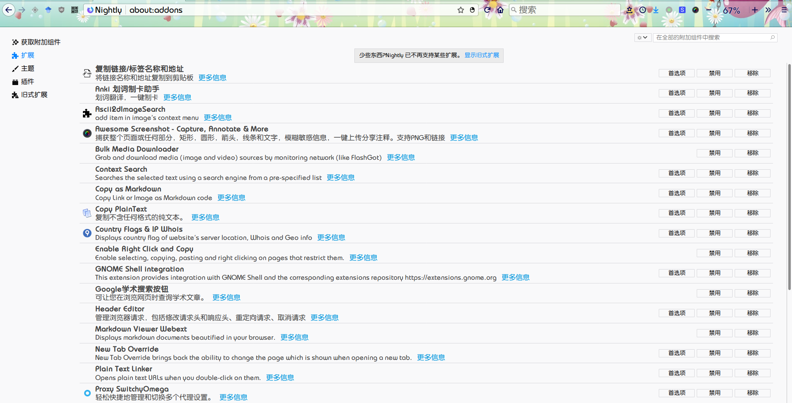
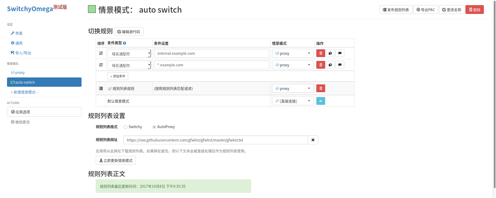

+++
title = "记录Linux上Firefox58的安装与配置"
date = '2017-10-08 23:33:07'
aliases = [ "articles/ji-lu-linuxshang-firefox58de-an-zhuang-yu-pei-zhi.html" ]

[taxonomies]
categories = ["articles"]
tags = [ "Firefox", "Nightly", "OpenSUSE", "Linux", "浏览器", "Proxy" ]
+++

由于用的OpenSUSE, 源里的Fiefox一直是Stable版, 目前才52, 但是我已经习惯了新版的速度.  

新版无论是启动速度还是页面打开速度都和52不是一个时代的, 多窗口多标签下也流畅了太多, 毕竟是由原来的多线程变成现在的多进程, Stylo并行加载CSS.


## 下载
从[Firefox Nightly](https://www.mozilla.org/zh-CN/firefox/nightly/all/)下载简体中文版的二进制版压缩包, 解压到本地点击可执行文件就能用.

## 图标
然后在本地新建个.desktop文件, 路径 `~/.local/share/applications/Firefox.desktop`, 你需要把里面的`Exec=/home/mxo/bin/firefox-nightly.zh-CN.linux-x86_64/firefox/firefox` 换成你自己的路径. 
```desktop
[Desktop Entry]
Name=Nightly
GenericName=Web Browser
GenericName[zh_CN]=网络浏览器
Comment=Browse the World Wide Web
Comment[zh_CN]=浏览互联网
Exec=/home/mxo/bin/firefox-nightly.zh-CN.linux-x86_64/firefox/firefox %u
Terminal=false
Type=Application
Icon=firefox-nightly
Categories=Network;WebBrowser;
MimeType=text/html;text/xml;application/xhtml+xml;application/vnd.mozilla.xul+xml;text/mml;x-scheme-handler/http;x-scheme-handler/https;x-scheme-handler/ftp;
StartupNotify=true
Actions=NewTab;NewWindow;NewPrivateWindow;

Name[zh_CN]=Nightly

[Desktop Action NewTab]
Name=Open new tab
Name[zh_CN]=打开新标签页
Exec=/home/mxo/bin/firefox-nightly.zh-CN.linux-x86_64/firefox/firefox -new-tab

[Desktop Action NewWindow]
Name=Open new window
Name[zh_CN]=打开新窗口
Exec=/home/mxo/bin/firefox-nightly.zh-CN.linux-x86_64/firefox/firefox -new-window

[Desktop Action NewPrivateWindow]
Name=New private window
Name[zh_CN]=新建隐私浏览窗口
Exec=/home/mxo/bin/firefox-nightly.zh-CN.linux-x86_64/firefox/firefox -private-window
```
注: 这里的可执行文件路径一定要和原文件相同, 我原来自做聪明用了一个软链接, 结果新建的窗口的图标不归属于原图标, 由于系统里还有个Stable版的Firefox, 就归属到它的图标上去了,233.

## 扩展

我使用的扩展



由于57以来Firefox彻底废除XUL, 迁移到WebExtension, 所以最近新扩展的出现和扩展的更新都比较频繁, 可以多关注下, 也许日后就得到了满意的呢.

原来纠结于没有好的Proxy扩展可以用, 最后发现`SwitchyOmega`测试版在Nightly上可用了.
由于好久没用过它, 还去找了找教程...

先是情景模式的proxy里选择你的代理协议,地址,端口.


然后在auto switch勾上规则列表规则, 后面的情景模式选择proxy(符合规则的就是被Q了的网站), 下一行的默认情景模式选择直接连接(没被Q的网站).  
规则列表设置里选 AutoProxy, 
网址填 `https://raw.githubusercontent.com/gfwlist/gfwlist/master/gfwlist.txt`



最后点击左侧的应用选项即可.

## 最后附上两张内存占用

单窗口几个标签页


三窗口一堆图片/视频标签页


你可能需要的:

* [Firefox 信仰充值中心](https://zhuanlan.zhihu.com/ilovefirefox)

* [狐吧](http://tieba.baidu.com/f?kw=firefox&fr=home)
